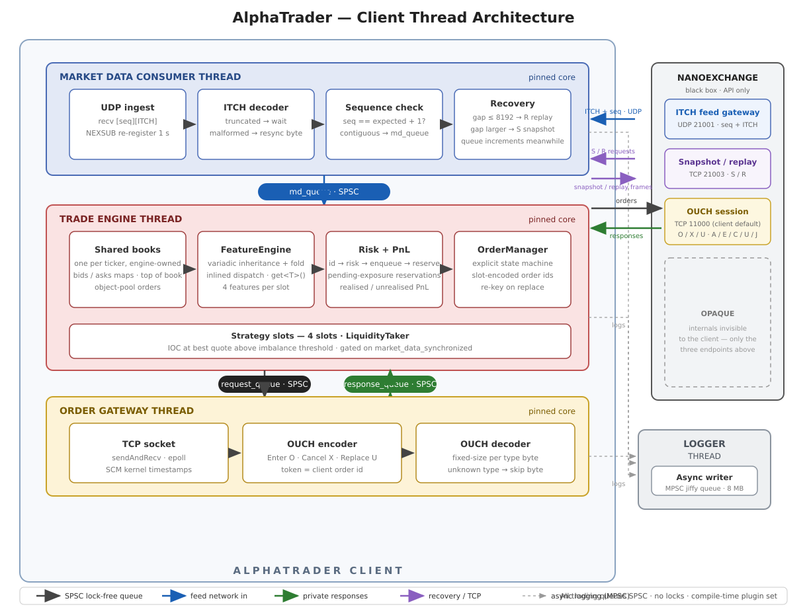
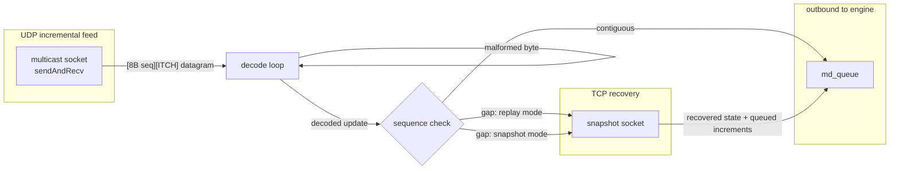
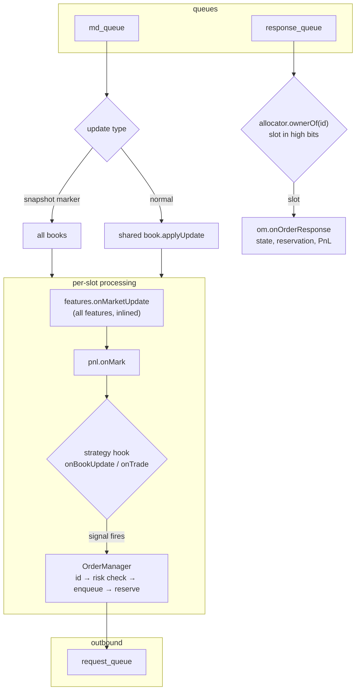
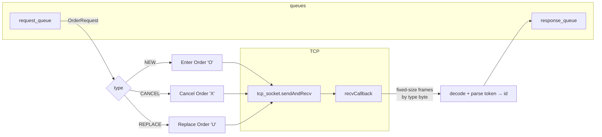
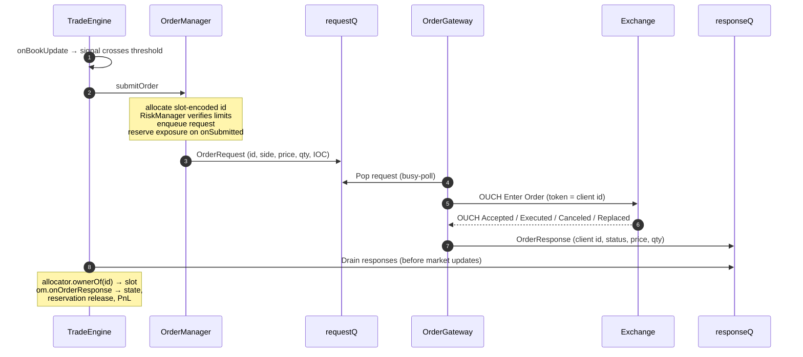
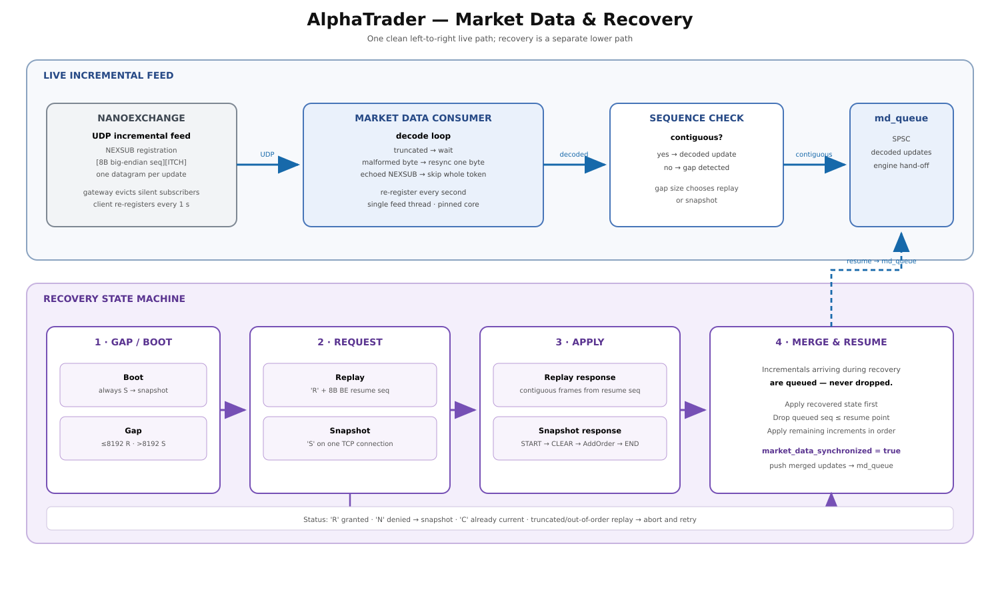

# AlphaTrader

AlphaTrader is a low-latency trading client written in C++20. It consumes an
**ITCH** market data feed over **UDP**, maintains its own order book, computes
trading features, runs strategies, and sends orders to an exchange as **OUCH**
messages over **TCP** — with risk limits and PnL tracking on the order path.

The design goal is a measurable trading-client prototype: a small hot path,
**no locks or allocations on the trading path**, and one thread per stage
connected by lock-free SPSC queues. Features and strategies are **C++20
concepts** — the extension mechanism is compile-time, so nothing on the trading
path is virtual. Queues, logging, thread pinning, socket helpers, object pools,
and wire-format definitions come from the vendored
[QuantLink](https://github.com/Yashwanth-1412/QuantLink) submodule. It trades
against [NanoExchange](https://github.com/Yashwanth-1412/NanoExchange).

## Architecture



The client runs three threads on the trading path (market-data consumer, trade
engine, order gateway), plus a dedicated logger thread. Every inter-thread
hand-off is a single-producer / single-consumer lock-free ring: no locks, no
condition variables, no allocation — consumers busy-poll.

```
      ITCH feed (UDP)              TCP snapshot / replay
             │                              │
   ┌─────────▼──────────────────────────────▼─────────┐
   │              MarketDataConsumer                  │  1 thread, pinned
   │  decode → sequence check → gap → recover → queue │
   └──────────────────────┬───────────────────────────┘
                          │ md_queue : SPSCQueue<MarketUpdate>
              ┌───────────▼────────────┐
              │      TradeEngine       │  1 thread, pinned
              │  books    (per ticker, shared)
              │  features (per slot)
              │  strategy (per slot)
              │  risk + PnL (per slot)
              └──┬──────────────────▲──┘
   request_queue │                  │ response_queue
              ┌──▼──────────────────┴──┐
              │      OrderGateway      │  1 thread, pinned
              │  OUCH encode / decode  │
              └───────────┬────────────┘
                          │ TCP
                       exchange
```

Each thread is pinned with `quantlink::utils::create_and_pin_thread`
(`--core-consumer` / `--core-engine` / `--core-gateway`, `-1` = let the OS
decide).

### MarketDataConsumer — the feed thread



The loop is kept simple on purpose. Registering with the feed gateway is
explicit: the client sends a 6-byte `NEXSUB` datagram to
`--incremental-ip:--incremental-port` and frames then arrive on
`--receive-port`. It re-registers every second, because the gateway evicts
subscribers that go silent and a lost registration datagram (UDP is
unreliable) must not permanently drop it from the stream; an echoed
`NEXSUB` token is skipped whole in the decode loop rather than parsed as
ITCH. The decode loop has a hard rule — **truncated means wait, malformed
means resync one byte** — so a single corrupt datagram can never wedge the
feed. A gap in the sequence numbers routes into the replay/snapshot recovery
state machine; incrementals that arrive during recovery are **queued, not
dropped**.

### TradeEngine — the strategy thread



One event loop, two drains per iteration: responses first (fills settle
before the next signal is evaluated on the new state), then market updates.
An update is applied to the ticker's **shared book once**, then fanned out to
every slot that trades it. Each slot's features absorb the update, the PnL
mark is refreshed, and the strategy hook decides whether to submit.

### OrderGateway — the wire thread



The gateway never trusts a wire length field: OUCH responses are fixed-size
per message type, so it resolves the frame size from the type byte and
rejects unknown types by skipping a byte. The client's order id rides inside
the 14-byte OUCH order token, so decoding a response is a `memcpy`-based
struct cast plus a token parse — no reverse lookup tables.

## The plugin system

Both extension points — features and strategies — are **C++20 concepts**, not
abstract base classes. A plugin is a plain struct whose *shape* satisfies a
concept; there is no base to derive from, no virtual method to override, and
no registration step. Conformance is the type.

### Features: a concept, variadic inheritance, and a fold

A feature is anything that can absorb a market update:

```cpp
template<typename Feature>
concept FeaturePlugin = requires(Feature feature, const MarketUpdate& update,
                                 const MarketOrderBook& book) {
    feature.onMarketUpdate(update, book);
};
```

`FeatureEngine` then inherits from the whole pack and fans updates out with a
comma fold — the signature template gadget of this codebase:

```cpp
template<typename... Features>
    requires(FeaturePlugin<Features> && ...)          // fold over the concept
struct FeatureEngine : public Features... {           // variadic inheritance
    void onMarketUpdate(const MarketUpdate& update, const MarketOrderBook& book) noexcept {
        (Features::onMarketUpdate(update, book), ...); // qualified fold call
    }

    template<typename T> T& get() noexcept { return *static_cast<T*>(this); }
    template<typename T> const T& get() const noexcept { return *static_cast<const T*>(this); }
};
```

Why this shape:

- `requires(FeaturePlugin<Features> && ...)` is a **fold over a concept** —
  each pack element is checked independently, so a malformed feature is named
  individually at its declaration, not buried in substitution errors.
- Inheriting from the pack stores feature state **inline as base subobjects**:
  the whole feature set is one contiguous object. No `vector<unique_ptr>`, no
  indirection, no allocation.
- `(Features::onMarketUpdate(update, book), ...)` calls each base. The calls
  are non-virtual and fully typed, so the compiler inlines the entire feature
  computation into the update loop and can keep intermediates in registers
  across features.
- `get<T>()` is a `static_cast` from derived to base — a compile-time offset,
  usually zero instructions. `features.get<MktPriceFeature>().value()` costs
  nothing beyond the load.

A real feature is seven lines, no inheritance, no macros:

```cpp
struct OrderBookImbalanceFeature {
    void onMarketUpdate(const MarketUpdate&, const MarketOrderBook& book) noexcept {
        const BBO& bbo = book.getBBO();
        int64_t total = static_cast<int64_t>(bbo.bid_qty) + bbo.ask_qty;
        if (UNLIKELY(bbo.bid_price == Price_INVALID || bbo.ask_price == Price_INVALID || total == 0)) {
            imbalance_ = Ratio_INVALID;
            return;
        }
        imbalance_ = static_cast<Ratio>((static_cast<int64_t>(bbo.bid_qty) - bbo.ask_qty) * Ratio_SCALE / total);
    }
    Ratio value() const noexcept { return imbalance_; }
  private:
    Ratio imbalance_ = Ratio_INVALID;
};
```

The price of this design: adding a feature is a recompile. For a system whose
plugin set is known at build time, that is the correct trade.

### Strategies: a multi-parameter concept with compound requirements

A strategy is anything with the three lifecycle hooks, where the update hooks
must return something convertible to a count of orders submitted:

```cpp
template<typename S, typename Features, typename OrderManagerT, typename PnlT>
concept Strategy = requires(S s, Entry<Features>& entry, const MarketUpdate& update,
                            const OMOrder& order, OrderManagerT& om, PnlT& pnl) {
    { s.onBookUpdate(entry, update, om, pnl) } -> std::convertible_to<size_t>;
    { s.onTrade(entry, update, om, pnl) }      -> std::convertible_to<size_t>;
    s.onOrderUpdate(order);
};
```

Two subtleties:

- `{ expr } -> std::convertible_to<size_t>` is a **compound requirement** — it
  constrains both that the expression is valid *and* that its result converts.
  A strategy returning `void` from `onBookUpdate` fails at its declaration
  with a readable message rather than at a call site three templates deep.
- `Strategy` is a *multi-parameter* concept: it constrains the relationship
  between a strategy, its feature set, its order manager and its PnL tracker —
  something no single-type interface could express. `TradeEngine` applies it
  as a trailing `requires` clause, so
  `TradeEngine<Features, BadStrategy>` fails with "constraint not satisfied"
  naming the offending requirement:

```cpp
template<typename Features, typename StrategyT,
         size_t MaxSlots = 4, size_t MaxTickers = 16, size_t MaxPendingOrders = 64>
    requires Strategy<StrategyT, Features,
                      OrderManager<RiskManager<MaxTickers, MaxPendingOrders>, PnLTracker<MaxTickers>>,
                      PnLTracker<MaxTickers>>
class TradeEngine { ... };
```

The shipped plugin is `LiquidityTaker`: when book imbalance crosses a
threshold it fires an **IOC order at the best quote** (pays the spread — the
honest characterisation of a taking strategy). Its hooks are templates, so one
implementation works against any engine instantiation.

### How the plugins are composed

Everything is assembled in `src/main.cpp`, where the concrete types are
chosen:

```cpp
using TradingFeatures = FeatureEngine<MktPriceFeature, SpreadFeature,
                                      OrderBookImbalanceFeature, AggTradeRatioFeature>;
using Engine          = TradeEngine<TradingFeatures, LiquidityTaker, 4, 16, 64>;
```

Four features, one strategy, four slots, sixteen tickers, sixty-four pending
orders — all fixed at compile time, all bounds-checked by the compiler, all
inlined into one loop. The engine instantiates one shared
`MarketOrderBook` per ticker and hands it to every slot that registered the
ticker, wrapped in an `Entry<Features>` that also holds the slot's **own**
feature state (`std::optional<Features>` — fixed-size array, genuinely empty
slots, no allocation).

## Order lifecycle



Details that matter:

- **Risk gate before the order is recorded.** `OrderManager` assigns the id
  first — then `RiskManager` verifies the request against per-ticker limits
  and the order only enters the outbound queue if it passes; exposure is
  reserved on `onSubmitted`, right after the enqueue. From that moment the
  order counts against its limits, and the pending-exposure reservation is
  released on fill, cancel, or reject. Checking only filled position would
  let a strategy send ten orders inside one round trip and land ten times
  over its limit.
- **The order id encodes its owning slot**: 16 bits of slot index in the high
  bits, a 48-bit counter below. Routing a fill back to the right strategy
  slot is a shift and a compare — and it happens on every exchange response.
  `ownerOf()` returning `slot_count_` for an out-of-range id is a "not mine"
  sentinel without an exception or an optional.
- **The order state machine is explicit** — `NOT_ACTIVE → ACTIVE →
  PARTIALLY_FILLED → COMPLETED`, with `CANCELLED` and `DEAD` as distinct
  terminal states. A cancel in flight is *not* a state (the order can still
  fill while the cancel is processed), so it rides on flags beside the enum.

## Market data and recovery



The feed delivers one datagram per update: `[ 8-byte big-endian sequence
number ][ ITCH payload ]`. `MarketDataConsumer` tracks the next expected
sequence number and, on a gap, picks a route based on how far behind it is:

| Mode | When | Cost |
|---|---|---|
| **Replay** (`R`) | gap within the exchange's replay window | cheap; book stays usable throughout |
| **Snapshot** (`S`) | gap larger than the replay window | full book state over TCP |

The recovery wire protocol is a single TCP connection to the snapshot
service, with a one-byte request plus a payload:

- **Boot** always starts with a snapshot: one `'S'` byte.
- **Replay** is `'R'` + the 8-byte big-endian sequence number to resume
  from. The client is limited to the exchange's replay window
  (`REPLAY_CAPACITY = 8192`, mirrored locally) and escalates to a snapshot
  for anything older.
- The server answers with one status byte: `'R'` (replay granted — frames
  follow and must be contiguous from the requested sequence number), `'N'`
  (denied — escalate to a snapshot), or `'C'` (already current — finish
  immediately). A truncated or out-of-order replay aborts the transfer and
  restarts from the last applied sequence number.

Either way, **incrementals arriving during recovery are queued, not dropped**,
then applied in order once the recovered state is in place — recovery that
discarded live data would simply cause a second gap on completion. Recovery
itself can fail (truncated transfer, dropped connection, streamer timeout);
falling back cleanly to "still out of sync" is a valid outcome, getting stuck
half-recovered is not. Both paths are driven hard by
`test_replay_recovery` / `test_snapshot_recovery`.

Trading is gated on synchronised data: a namespace-scope
`inline std::atomic<bool> market_data_synchronized` (one instance across all
translation units, no `extern`/definition split) stays false until an
authoritative snapshot *and* every queued incremental behind it have been
applied. The engine refuses to start until it is set. A strategy acting on a
partially-built book reads missing levels and concludes the spread is
enormous — precisely the condition many signals treat as an opportunity.

## Order book

One `MarketOrderBook` per ticker, shared by all strategy slots:

- `std::map<Price, PriceLevel>` per side using the **transparent** comparators
  (`std::greater<>` / `std::less<>`) — reversed on the bid side so `begin()`
  is the top of book on both sides, no special-casing.
- An `unordered_map` from exchange order reference to `{side, level, order}`
  makes cancels and executions a hash lookup plus an intrusive unlink — no
  scan of the level's list.
- Orders and price levels come from `quantlink::ObjectPool` (the intrusive
  free-list implementation), so book churn recycles nodes — **nothing on the
  trading path allocates**.
- Rule-of-five deletion: the book is shared by pointer across slots and holds
  pool pointers into its own storage. Copying desynchronises slots; moving
  dangles every `Entry::book`.

## Protocols

OUCH/ITCH wire structs live in `QuantLink/Lib/protocol/`; encode/decode logic
in `src/order_gateway/` and `src/market_data/`. Both are fixed-layout,
big-endian formats.

**OUCH (order entry, TCP)** — the client sends:

| Direction | Message | Type byte |
|---|---|---|
| Client → Exchange | Enter Order | `O` |
| Client → Exchange | Cancel Order (full or partial) | `X` |
| Client → Exchange | Replace Order | `U` |

and decodes the exchange's responses: Accepted `A`, Executed `E`, Canceled
`C`, Replaced `U`, Cancel Rejected `J`. IOC orders map to OUCH TIF 0
(fill-and-kill); resting orders to a non-zero TIF. Prices are 32-bit
fixed-point (4 decimal places), and the client's order id rides in the
14-byte order token — response encoding never needs a reverse lookup.

**ITCH (market data, UDP + snapshot stream):**

| Update | ITCH message | Type byte |
|---|---|---|
| Order added to book | Add Order | `A` |
| Trade | Order Executed (with match number) | `E` |
| Order removed | Order Delete | `D` |
| Order replaced | Order Replace | `U` |

Snapshot control markers (`SNAPSHOT_START` / `CLEAR` / `END`) are carried in
frames with reserved `stock_locate` values (`0xBBBB` / `0xCCCC` / `0xEEEE`),
so snapshot bytes remain valid ITCH framing.

## Repository layout

```text
AlphaTrader/
├── CMakeLists.txt
├── QuantLink/                    # vendored submodule: queues, logger, sockets,
│                                 #   object pools, OUCH/ITCH wire structs
├── scripts/                      # check_multicast.py — interface multicast check
├── src/
│   ├── main.cpp                  # wiring + plugin composition (see above)
│   ├── types.h                   # domain messages + snapshot control values
│   ├── market_order_book.*       # per-ticker limit order book (shared)
│   ├── market_data/
│   │   ├── itch_decoder.*        # ITCH decode: truncated vs malformed
│   │   ├── market_data_consumer.*# feed thread: seq check, recovery, queuing
│   │   ├── market_data_incremental.cpp
│   │   └── market_data_recovery.*# replay / snapshot state machine
│   ├── order_gateway/            # OUCH encode/decode, token, TCP I/O
│   └── trading/
│       ├── strategy.h            # Strategy concept + LiquidityTaker
│       ├── trade_engine.h        # the three-thread heart: slots, books, loop
│       ├── order_manager.h       # order lifecycle + client id allocation
│       ├── order_id_allocator.h  # slot-encoding id generation
│       ├── risk_manager.h        # limits + pending-exposure reservations
│       ├── pnl_tracker.h         # realised / unrealised PnL
│       └── features/             # feature concept + 4 shipped features
├── test/                         # unit + recovery + integration tests
└── tools/
    └── compete.py                # drive multiple client instances vs one exchange
```

## Build

Requirements: Linux, C++20 compiler, CMake ≥ 3.20, git submodules initialized.

```bash
git submodule update --init --recursive   # if QuantLink/ is empty
cmake -S . -B build
cmake --build build -j
```

Builds with `-O3 -march=native -Wall -Wextra -Werror` — binaries are tuned
for the build machine, and warnings are errors.

| Target | Description |
|---|---|
| `alpha_trader` | The trading client |
| `test_trading` | Features, strategy signals, PnL arithmetic |
| `test_order_manager` | Order lifecycle, risk rejection, reservation release |
| `test_trade_engine` | Slot routing, shared books, fill attribution |
| `test_order_gateway` | OUCH encode/decode round-trip |
| `test_snapshot_recovery` | Snapshot sync, queued incrementals, aborts |
| `test_replay_recovery` | Gap detection, replay requests, resume ordering |
| `test_integration` | Consumer → engine → gateway against a live exchange |

## Run

```text
alpha_trader [--gateway-ip <ip>] [--gateway-port <port>]
             [--incremental-ip <ip>] [--incremental-port <port>]
             [--receive-port <port>]
             [--snapshot-ip <ip>] [--snapshot-port <port>]
             [--mcast-iface <iface>] [--ticker <id>]...
             [--position-limit <n>] [--order-limit <n>] [--notional-limit <n>]
             [--ioc-qty <n>] [--imbalance <ratio>]
             [--core-consumer <n>] [--core-engine <n>] [--core-gateway <n>]
```

| Option | Default | Meaning |
|---|---|---|
| `--gateway-ip` / `--gateway-port` | `127.0.0.1:11000` | exchange OUCH endpoint |
| `--incremental-ip` / `--incremental-port` | `127.0.0.1:21001` | exchange feed gateway |
| `--receive-port` | `22001` | local UDP port for the feed |
| `--snapshot-ip` / `--snapshot-port` | `127.0.0.1:21003` | TCP snapshot / replay |
| `--mcast-iface` | `lo` | interface for the incremental feed |
| `--ticker <id>` | `1` | register a ticker (repeatable) |
| `--position-limit` / `--order-limit` / `--notional-limit` | `100` / `10` / `100000000` | per-ticker risk limits |
| `--ioc-qty` / `--imbalance` | `10` / `300000` | liquidity taker signal config |
| `--core-consumer` / `--core-engine` / `--core-gateway` | `-1` | core pinning (`-1` = unpinned) |

Loopback example against a local NanoExchange:

```bash
# terminal 1 — exchange on gateway 21000, feed 21001, snapshot 21003
../NanoExchange/build/NanoExchange lo 21000 127.0.0.1 21001 21003 lo

# terminal 2 — client, matching the exchange's ports explicitly
./build/alpha_trader --gateway-port 21000 --ticker 1 --ioc-qty 10 --imbalance 900000
```

`--incremental-port` and `--receive-port` must differ — the client registers
with the exchange's feed port and listens on its own.

On `SIGINT`/`SIGTERM` the client shuts down in reverse order — consumer,
engine, gateway — then prints a session summary: orders sent, replaces,
cancels, risk rejections, fills, filled quantity, and per-ticker position and
PnL. A log is appended to `alpha_trader.log` in the working directory
(8 MB MPSC logger queue).

### Multiple clients

Each `alpha_trader` instance needs its own `--receive-port` (one UDP listener
per process) and, ideally, its own `--core-*` pins. Running several in the
same directory makes them share `alpha_trader.log` — launch extra instances
from separate working directories. For a turnkey multi-client run,
`tools/compete.py` drives the whole setup: it starts NanoExchange, seeds the
book, and spawns rival clients, each with its own receive port; `--pin`
spreads every participant across its own core:

```bash
./tools/compete.py demo --pin
```

## Tests

```bash
cd build
for t in test_trading test_order_manager test_trade_engine test_order_gateway \
         test_snapshot_recovery test_replay_recovery test_integration; do ./$t; done
```

The recovery tests carry the most weight, because recovery is where the
failure modes live. The happy path is exercised constantly at runtime; a
truncated snapshot or an interrupted replay is rare enough that it will only
ever be correct if it is tested. `test_integration` needs a running
NanoExchange (it launches it from `../NanoExchange/build/`).

## Known limitations

- Single consumer/engine/gateway thread, fixed ticker and slot counts, no
  persistence.
- Plugin sets are compile-time — adding a feature or strategy is a recompile.
- One strategy shipped (`LiquidityTaker`); a strategy has no access to order
  book history, only current state.
- UDP delivery is best-effort by design — recovery depends on the exchange's
  replay window and snapshot service.
- The wire protocol surface is a focused OUCH/ITCH subset, not a full venue.

## Design notes

Techniques that show up once in the code and are worth a second look:

- **`__int128` notional checks** — price × quantity exceeds 64 bits at
  scaled-integer prices; a silently overflowing risk check reports the
  *smallest* notional for the *largest* orders. `RiskManager` widens the
  comparison to `__int128`, so the arithmetic is exact.
- **Non-type template parameters as capacity** — `MaxTickers` /
  `MaxSlots` / `MaxPendingOrders` size the fixed arrays; capacity
  exhaustion is a return value, never a `bad_alloc`. Slots are validated
  against both the compile-time extent and the runtime count, so the
  compiler keeps the array bounds provable.
- **Fixed-point ratios, not floats** — signals are integers scaled by
  `Ratio_SCALE`, with a distinct `Ratio_INVALID` sentinel: deterministic,
  reproducible, and free of floating-point comparison hazards in
  threshold logic. "No signal" is never confused with "signal is zero".
- **Scoped enums as outcome types** — `enum class RiskResult : uint8_t`
  makes a rejection report *why* (one byte, no accidental comparison with
  an order state), which is what makes rejection logs and tests
  actionable.