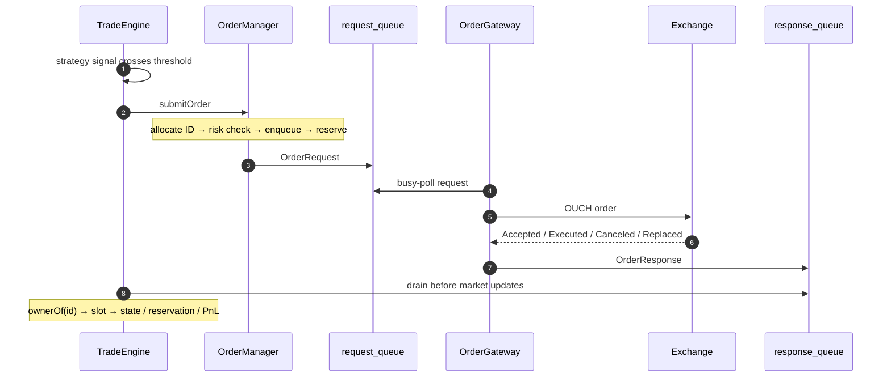

# AlphaTrader

**AlphaTrader** is a low-latency trading client written in **C++20**. It consumes
**ITCH market data over UDP**, maintains a per-ticker limit order book, computes
compile-time composed features, runs a strategy, and sends **OUCH orders over TCP**.

The project is designed as a measurable trading-client prototype with a deliberately
small hot path:

- **3 trading-path threads:** `MarketDataConsumer`, `TradeEngine`, `OrderGateway`
- **Lock-free SPSC queues** between stages
- **Busy-polling** consumers
- **No locks, condition variables, or dynamic allocation on the trading path**
- **C++20 concepts** for compile-time feature and strategy composition
- **Pinned threads** for deterministic CPU placement
- Explicit **risk, order-state, PnL, sequence-gap, replay, and snapshot handling**

The low-level queues, logging, sockets, object pools, and ITCH/OUCH wire definitions
come from the vendored [QuantLink](https://github.com/Yashwanth-1412/QuantLink)
submodule. AlphaTrader trades against
[NanoExchange](https://github.com/Yashwanth-1412/NanoExchange).

---

## Architecture


The hot path is intentionally linear:

```text
              ITCH / UDP
                  │
                  ▼
        ┌─────────────────────┐
        │  MarketDataConsumer │  1 thread
        │ decode → seq → gap  │  pinned
        │ recover → queue     │
        └──────────┬──────────┘
                   │ md_queue
                   ▼
        ┌─────────────────────┐
        │     TradeEngine     │  1 thread
        │ books → features    │  pinned
        │ → PnL → strategy    │
        │ → risk → orders     │
        └───────┬───────▲─────┘
                │       │
       request_queue  response_queue
                │       │
                ▼       │
        ┌─────────────────────┐
        │    OrderGateway     │  1 thread
        │ OUCH encode/decode  │  pinned
        └──────────┬──────────┘
                   │
                  TCP
                   │
                   ▼
                Exchange
```

There is also a dedicated logger thread. Each trading-stage hand-off is an SPSC
ring; consumers busy-poll rather than blocking.

Thread pinning is provided by
`quantlink::utils::create_and_pin_thread`:

```text
--core-consumer   MarketDataConsumer
--core-engine     TradeEngine
--core-gateway    OrderGateway

-1 = let the OS choose
```

### Data flow at a glance

```text
Exchange
  │
  ├── ITCH / UDP ──► MarketDataConsumer
  │                       │
  │                       └── md_queue ──► TradeEngine
  │                                             │
  │                                             └── request_queue
  │                                                    │
  │                                                    ▼
  │                                              OrderGateway
  │                                                    │
  │                                                    └── OUCH / TCP ──► Exchange
  │
  └── Snapshot / Replay / TCP ◄──── MarketDataConsumer recovery
```

The two paths are intentionally separated: **live market data**, **order entry**, and
**recovery** are distinct flows.

---

# 1. Market Data

## MarketDataConsumer


The feed thread performs:

```text
UDP datagram
    │
    ▼
decode ITCH
    │
    ▼
sequence check
    ├── contiguous ──► md_queue
    │
    └── gap ──► replay / snapshot recovery
                       │
                       ▼
              queue live incrementals
                       │
                       ▼
              recovered state
                       │
                       ▼
                 merge in order
                       │
                       ▼
                    md_queue
```

Each incremental datagram is:

```text
[ 8-byte big-endian sequence number ][ ITCH payload ]
```

The feed gateway requires explicit registration. The client sends a 6-byte
`NEXSUB` datagram to `--incremental-ip:--incremental-port`, while frames arrive on
`--receive-port`.

The client re-registers every second because the gateway evicts silent subscribers.
An echoed `NEXSUB` token is skipped as a whole rather than being interpreted as ITCH.

### Decode rules

The decoder follows two important rules:

- **Truncated input → wait for more bytes**
- **Malformed input → resynchronize by one byte**

This prevents a corrupt datagram from wedging the feed loop.

### Sequence gaps

`MarketDataConsumer` tracks the next expected sequence number. A gap enters the
recovery state machine rather than silently discarding live data.

**Incrementals received during recovery are queued, not dropped.**

---

# 2. Recovery

The recovery service uses a single TCP connection.

| Mode | Trigger | Request | Purpose |
|---|---|---|---|
| **Snapshot** | Boot or gap > replay window | `S` | Rebuild authoritative book state |
| **Replay** | Gap within replay window | `R` + sequence | Recover missing incrementals cheaply |

The replay capacity is:

```text
REPLAY_CAPACITY = 8192
```

### Recovery protocol

```text
                  ┌──────────────┐
                  │ Boot / Gap   │
                  └──────┬───────┘
                         │
             ┌───────────┴───────────┐
             │                       │
          gap ≤ 8192              gap > 8192
             │                       │
             ▼                       ▼
       R + sequence                  S
             │                       │
             └───────────┬───────────┘
                         ▼
                   TCP recovery
                         │
              ┌──────────┼──────────┐
              │          │          │
              R          N          C
           granted     denied    current
              │          │          │
              ▼          └──► S     │
        replay frames               │
              │                     │
              └──────────┬──────────┘
                         ▼
                 apply recovered state
                         │
                         ▼
              apply queued incrementals
                         │
                         ▼
                  synchronized
```

The server response status is:

- `R` — replay granted; frames must be contiguous
- `N` — replay denied; escalate to snapshot
- `C` — already current; recovery can finish immediately

A truncated or out-of-order replay aborts the transfer and restarts from the last
applied sequence number.

### Recovery invariant

Recovery must never create a second gap by throwing away live data.

The client therefore:

1. Detects the gap.
2. Requests replay or snapshot.
3. Continues queueing incoming incrementals.
4. Installs the recovered state.
5. Applies queued increments in sequence order.
6. Marks market data synchronized.
7. Resumes normal trading.

Trading is gated by:

```cpp
inline std::atomic<bool> market_data_synchronized;
```

It remains `false` until an authoritative state **and every queued incremental behind
it** have been applied.

---

# 3. TradeEngine

The `TradeEngine` is the strategy thread.

Each loop iteration drains:

1. **`response_queue` first**
2. **`md_queue` second**

Processing responses first means fills and cancellations settle before the next strategy
decision is made on the updated state.

```text
response_queue
      │
      ▼
ownerOf(order_id)
      │
      ▼
strategy slot
      │
      └──► order state / reservation / PnL


md_queue
   │
   ▼
update type
   │
   ├── snapshot marker ──► all books
   │
   └── normal update ────► shared book
                              │
                              ▼
                         feature engine
                              │
                              ▼
                            PnL
                              │
                              ▼
                           strategy
                              │
                         signal fires
                              │
                              ▼
                        OrderManager
                              │
                         risk check
                              │
                         request_queue
```

## Shared order books

There is one `MarketOrderBook` per ticker, shared by every strategy slot trading that
ticker.

A market update is applied to the shared book **once**, then fanned out to each slot.

Each slot owns its own feature state.

This gives the architecture:

```text
              MarketOrderBook
                    │
        ┌───────────┼───────────┐
        ▼           ▼           ▼
     Slot 0       Slot 1      Slot N
     features    features    features
        │           │           │
      PnL         PnL         PnL
        │           │           │
     strategy    strategy    strategy
```

The shipped configuration is:

```cpp
using TradingFeatures =
    FeatureEngine<
        MktPriceFeature,
        SpreadFeature,
        OrderBookImbalanceFeature,
        AggTradeRatioFeature>;

using Engine =
    TradeEngine<TradingFeatures, LiquidityTaker, 4, 16, 64>;
```

That means:

```text
4 features
1 strategy
4 slots
16 tickers
64 pending orders
```

All are fixed at compile time.

---

# 4. Compile-Time Plugin System

Features and strategies are **C++20 concepts**, not virtual interfaces.

A plugin is a plain type whose shape satisfies a concept:

```text
No base class
No virtual dispatch
No runtime registration
No plugin allocation
```

The compiler determines the composition.

## Features

A feature must provide:

```cpp
template<typename Feature>
concept FeaturePlugin =
    requires(Feature feature,
             const MarketUpdate& update,
             const MarketOrderBook& book) {
        feature.onMarketUpdate(update, book);
    };
```

`FeatureEngine` inherits from all feature types and fans updates out with a comma fold:

```cpp
template<typename... Features>
    requires (FeaturePlugin<Features> && ...)
struct FeatureEngine : public Features... {

    void onMarketUpdate(const MarketUpdate& update,
                        const MarketOrderBook& book) noexcept {
        (Features::onMarketUpdate(update, book), ...);
    }

    template<typename T>
    T& get() noexcept {
        return *static_cast<T*>(this);
    }
};
```

### Why this design?

- `requires (FeaturePlugin<Features> && ...)` validates every feature in the pack.
- Feature state is stored inline as base subobjects.
- There is no `vector<unique_ptr<...>>` or runtime indirection.
- Calls are non-virtual and statically typed.
- `get<T>()` retrieves a feature through a compile-time base conversion.

The trade-off is explicit: **adding a feature requires recompilation**.

For a statically known strategy/feature set, this is intentional.

## Strategies

A strategy is constrained by a multi-parameter concept:

```cpp
template<typename S, typename Features,
         typename OrderManagerT, typename PnlT>
concept Strategy =
    requires(S s,
             Entry<Features>& entry,
             const MarketUpdate& update,
             const OMOrder& order,
             OrderManagerT& om,
             PnlT& pnl) {

        { s.onBookUpdate(entry, update, om, pnl) }
            -> std::convertible_to<size_t>;

        { s.onTrade(entry, update, om, pnl) }
            -> std::convertible_to<size_t>;

        s.onOrderUpdate(order);
    };
```

The concept constrains the relationship between the strategy, features,
`OrderManager`, and PnL tracker.

The shipped strategy is **`LiquidityTaker`**. It submits an **IOC order at the best
quote** when book imbalance crosses its configured threshold.

---

# 5. Order Management & Risk

The order path is:

```text
Strategy
   │
   ▼
OrderManager
   │
   ├── allocate slot-encoded ID
   │
   ├── RiskManager
   │      │
   │      └── reject if limit exceeded
   │
   ├── request_queue
   │
   └── reserve exposure
          │
          ▼
     OrderGateway
```

Risk is checked **before the order enters the outbound queue**.

Exposure is reserved immediately after submission so a strategy cannot issue multiple
orders inside one round trip and temporarily exceed its configured limits.

Reservations are released on fill, cancellation, or rejection.

## Slot-encoded order IDs

The client order ID contains:

```text
[ 16-bit strategy slot ][ 48-bit counter ]
```

Therefore a response can be routed to its owner with arithmetic rather than a reverse
lookup table.

```text
exchange response
       │
       ▼
allocator.ownerOf(id)
       │
       ▼
strategy slot
```

An out-of-range slot returns `slot_count_` as the "not mine" sentinel.

## Order state machine

```text
NOT_ACTIVE
    │
    ▼
 ACTIVE
    │
    ├──► PARTIALLY_FILLED ──► COMPLETED
    │
    ├──► CANCELLED
    │
    └──► DEAD
```

A cancel in flight is represented by flags rather than as a separate state because an
order can still execute while cancellation is being processed.

---

# 6. OrderGateway

`OrderGateway` is the wire thread.

```text
request_queue
      │
      ▼
  message type
   ┌──┼────┐
   │  │    │
   O  X    U
   │  │    │
   └──┼────┘
      ▼
  OUCH / TCP
      │
      ▼
   Exchange
      │
      ▼
response type
      │
      ▼
decode + token parse
      │
      ▼
response_queue
```

The gateway supports:

| Direction | Message | Type |
|---|---|---|
| Client → Exchange | Enter Order | `O` |
| Client → Exchange | Cancel Order | `X` |
| Client → Exchange | Replace Order | `U` |

Responses include:

```text
A = Accepted
E = Executed
C = Canceled
U = Replaced
J = Cancel Rejected
```

OUCH responses are fixed-size by message type. The gateway determines frame size from
the type byte rather than trusting a wire length field.

The client's order ID is carried inside the 14-byte OUCH order token, so the gateway
does not need a reverse lookup table.

---

# 7. Order Lifecycle



---

# 8. Order Book

`MarketOrderBook` is shared per ticker.

### Data structures

- `std::map<Price, PriceLevel>` for each side
- Transparent `std::greater<>` / `std::less<>` comparators
- `unordered_map` from exchange order reference to `{side, level, order}`
- `quantlink::ObjectPool` for orders and price levels

The bid comparator is reversed so `begin()` is the top of book on both sides.

Cancels and executions use the exchange-order-reference hash lookup followed by an
intrusive unlink rather than scanning an entire price level.

The object pool recycles nodes, keeping book churn allocation-free on the trading path.

### Ownership constraint

The book is shared by pointer across strategy slots and contains pointers into its own
pool storage.

Copying or moving the book would invalidate that ownership model, so the rule-of-five
operations are deliberately restricted.

---

# 9. Protocols

Wire structs live in:

```text
QuantLink/Lib/protocol/
```

Encode/decode logic lives in:

```text
src/market_data/
src/order_gateway/
```

Both protocols use fixed-layout, big-endian wire formats.

## ITCH

| Update | Message | Type |
|---|---|---|
| Add order | Add Order | `A` |
| Trade | Order Executed | `E` |
| Remove order | Order Delete | `D` |
| Replace order | Order Replace | `U` |

Snapshot control markers are represented using reserved `stock_locate` values:

```text
SNAPSHOT_START = 0xBBBB
CLEAR          = 0xCCCC
END            = 0xEEEE
```

This keeps snapshot data inside the existing ITCH framing.

## OUCH

Prices are 32-bit fixed-point values with four decimal places.

IOC orders use OUCH TIF `0` (fill-and-kill); resting orders use a non-zero TIF.

The 14-byte order token carries the client's order ID.

---

# 10. Repository Layout

```text
AlphaTrader/
├── CMakeLists.txt
├── QuantLink/                     # vendored submodule
│                                  # queues, logger, sockets, pools, wire structs
├── scripts/
│   └── check_multicast.py
├── src/
│   ├── main.cpp                   # wiring + compile-time composition
│   ├── types.h                    # domain messages + snapshot markers
│   ├── market_order_book.*
│   ├── market_data/
│   │   ├── itch_decoder.*
│   │   ├── market_data_consumer.*
│   │   ├── market_data_incremental.cpp
│   │   └── market_data_recovery.*
│   ├── order_gateway/             # OUCH encode/decode + TCP I/O
│   └── trading/
│       ├── strategy.h
│       ├── trade_engine.h
│       ├── order_manager.h
│       ├── order_id_allocator.h
│       ├── risk_manager.h
│       ├── pnl_tracker.h
│       └── features/
├── test/
└── tools/
    └── compete.py
```

---

# 11. Build

### Requirements

- Linux
- C++20 compiler
- CMake ≥ 3.20
- Git submodules initialized

```bash
git submodule update --init --recursive
cmake -S . -B build
cmake --build build -j
```

The project builds with:

```text
-O3 -march=native -Wall -Wextra -Werror
```

The resulting binaries are tuned for the build machine.

### Targets

| Target | Purpose |
|---|---|
| `alpha_trader` | Trading client |
| `test_trading` | Features, strategy signals, PnL arithmetic |
| `test_order_manager` | Order lifecycle, risk, reservations |
| `test_trade_engine` | Slot routing, shared books, fill attribution |
| `test_order_gateway` | OUCH encode/decode |
| `test_snapshot_recovery` | Snapshot synchronization and failures |
| `test_replay_recovery` | Gap detection and replay ordering |
| `test_integration` | Consumer → engine → gateway against NanoExchange |

---

# 12. Run

```text
alpha_trader
    [--gateway-ip <ip>] [--gateway-port <port>]
    [--incremental-ip <ip>] [--incremental-port <port>]
    [--receive-port <port>]
    [--snapshot-ip <ip>] [--snapshot-port <port>]
    [--mcast-iface <iface>]
    [--ticker <id>]...
    [--position-limit <n>]
    [--order-limit <n>]
    [--notional-limit <n>]
    [--ioc-qty <n>]
    [--imbalance <ratio>]
    [--core-consumer <n>]
    [--core-engine <n>]
    [--core-gateway <n>]
```

### Default configuration

| Option | Default | Meaning |
|---|---|---|
| `--gateway-ip/port` | `127.0.0.1:11000` | OUCH endpoint |
| `--incremental-ip/port` | `127.0.0.1:21001` | Feed gateway |
| `--receive-port` | `22001` | Local UDP listener |
| `--snapshot-ip/port` | `127.0.0.1:21003` | Snapshot/replay TCP |
| `--mcast-iface` | `lo` | Incremental-feed interface |
| `--ticker` | `1` | Ticker registration; repeatable |
| `--position-limit` | `100` | Per-ticker position limit |
| `--order-limit` | `10` | Per-ticker order limit |
| `--notional-limit` | `100000000` | Per-ticker notional limit |
| `--ioc-qty` | `10` | IOC quantity |
| `--imbalance` | `300000` | Strategy threshold |
| `--core-*` | `-1` | CPU pinning; `-1` = unpinned |

### Local NanoExchange

```bash
# Terminal 1 — exchange
../NanoExchange/build/NanoExchange \
    lo 21000 127.0.0.1 21001 21003 lo

# Terminal 2 — client
./build/alpha_trader \
    --gateway-port 21000 \
    --ticker 1 \
    --ioc-qty 10 \
    --imbalance 900000
```

`--incremental-port` and `--receive-port` must differ: the former is the exchange
feed gateway, while the latter is the client's UDP receive port.

On `SIGINT`/`SIGTERM`, the client shuts down in reverse stage order and prints a
session summary containing orders, replaces, cancels, risk rejections, fills,
filled quantity, position, and PnL.

Logs are appended to:

```text
alpha_trader.log
```

using the QuantLink logger.

---

# 13. Multiple Clients

Each AlphaTrader process needs its own `--receive-port`.

For clean CPU placement, assign separate `--core-*` pins to each client.

When running multiple clients, use separate working directories if you want separate
log files.

For a turnkey competition setup:

```bash
./tools/compete.py demo --pin
```

This starts NanoExchange, seeds the book, and launches rival clients with separate
receive ports and CPU placement.

---

# 14. Tests

Run the complete test suite:

```bash
cd build

for t in \
    test_trading \
    test_order_manager \
    test_trade_engine \
    test_order_gateway \
    test_snapshot_recovery \
    test_replay_recovery \
    test_integration
do
    ./$t
done
```

Recovery tests are particularly important because the difficult correctness cases are
not the happy path:

- truncated snapshot/replay
- interrupted replay
- dropped recovery connection
- sequence gaps
- queued incrementals during recovery
- resume ordering

`test_integration` requires a running NanoExchange and uses the local exchange setup.

---

# 15. Design Constraints & Trade-offs

This project intentionally chooses predictability and explicit ownership over generality.

### No runtime polymorphism

Features and strategies are compile-time concepts.

**Benefit:** no virtual dispatch or runtime registration on the hot path.

**Trade-off:** changing the plugin set requires recompilation.

### Fixed capacities

Ticker count, slot count, and pending-order capacity are compile-time parameters.

```text
MaxTickers
MaxSlots
MaxPendingOrders
```

Capacity exhaustion is represented as a return result rather than `bad_alloc`.

### Fixed-point arithmetic

Signals use integer ratios scaled by `Ratio_SCALE`, with a separate
`Ratio_INVALID` sentinel.

This avoids floating-point comparison ambiguity in threshold logic.

### Exact notional checks

Price × quantity can exceed 64-bit arithmetic at scaled prices, so `RiskManager`
uses `__int128` for exact notional comparisons.

### Explicit outcome types

`enum class RiskResult : uint8_t` records why an order was rejected without relying
on implicit integer comparisons.

---

# 16. Known Limitations

- One consumer, engine, and gateway thread.
- Fixed ticker and strategy-slot capacities.
- No persistence.
- Plugin sets are compile-time.
- One strategy is currently shipped: `LiquidityTaker`.
- Strategies do not have order-book history beyond current state.
- UDP delivery is best-effort; recovery depends on the exchange replay window and
  snapshot service.
- OUCH/ITCH support is a focused protocol subset rather than a complete venue
  implementation.

---

# 17. Why This Project?

AlphaTrader is less about building a generic trading framework and more about making
the performance-critical path **small, explicit, measurable, and testable**.

The interesting parts are deliberately close to the wire and the hot loop:

```text
UDP / ITCH
    ↓
sequence-aware decoding
    ↓
lock-free SPSC
    ↓
shared order book
    ↓
compile-time feature fan-out
    ↓
strategy
    ↓
risk + order lifecycle
    ↓
lock-free SPSC
    ↓
OUCH / TCP
```

The recovery path is treated as a first-class correctness problem rather than an
afterthought: live incrementals are preserved during recovery, recovered state is
merged in sequence order, and trading remains disabled until synchronization is
complete.

That combination — **low-latency execution path + explicit recovery semantics +
compile-time extensibility + focused tests** — is the core design of AlphaTrader.
